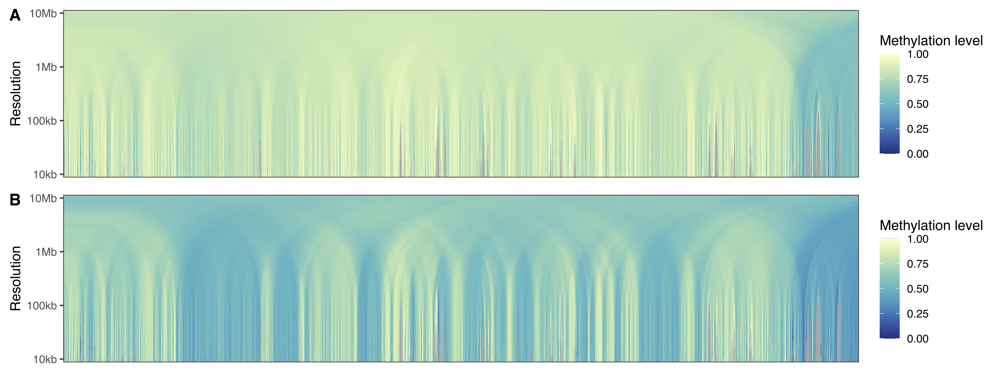
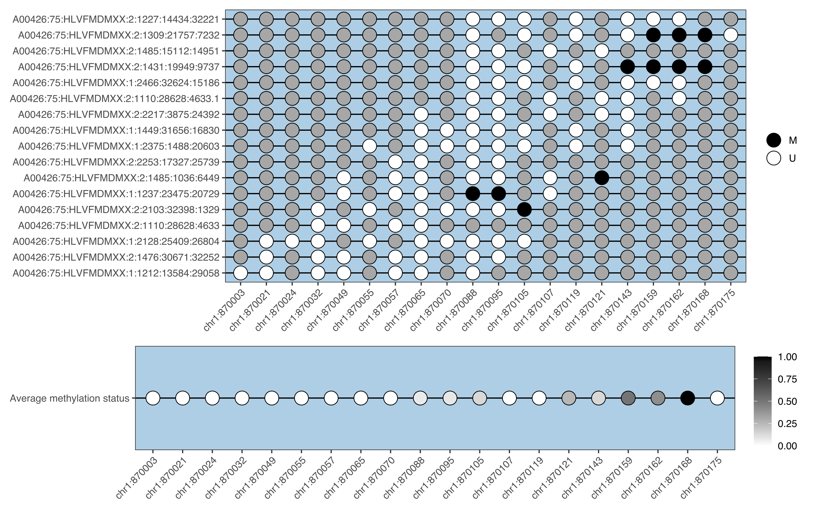

<br />
<br />
<br />

## bisplotti

bisplotti is a part of the greater suite of tools (BISCUIT, biscuiteer, and
SeSAMe) used for both whole-genome methylation sequencing (WGMS) and
methylation array data. Specifically, bisplotti is a package dedicated to 
producing commonly utilized exploratory data analysis and plotting. 

Install from Github

```
## using BiocManager from CRAN
install.packages("BiocManager")
BiocManager::install("huishenlab/bisplotti")
```

Some rudimentary plotting ideas. Not all of these are fully implemented yet.

### Multi-scale plots of solo-WCGWs

<p align="center">
  
</p>

### Epiread and epiallele 


