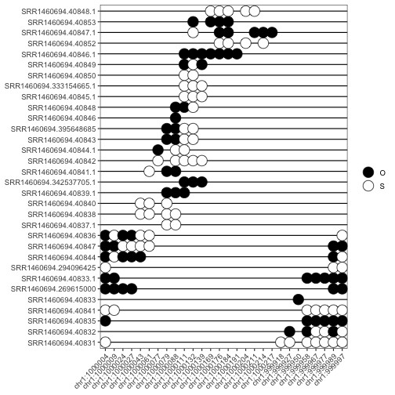
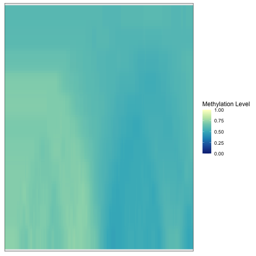
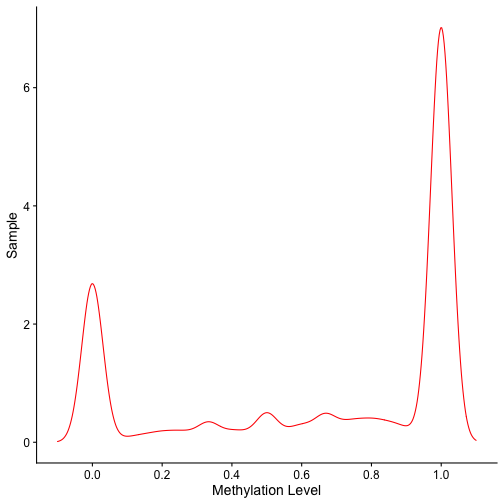

# Bisplotti

`bisplotti` is a package to generate commonly produced plots in DNA methylation
sequencing analyses. It creates plots from standard Bioconductor formats (i.e.,
`GRanges`) and the commonly used `BSseq` format.

# Quick Start

## Installing

A development version is available on GitHub and can be installed via:


```r
if (!requireNamespace("BiocManager", quietly=TRUE)) {
    install.packages("BiocManager")
}

BiocManager::install("huishenlab/bisplotti")
```


```r
library(bisplotti)
```

# Create Plots

## Epiread

To create the lollipop epiread plots, two commands are needed. First, use the
GRanges output from `biscuiteer::readEpibed()` as input to `tabulateEpibed`,
which turns the GRanges into a convenient matrix format. The second command,
`plotEpiread` uses the matrix output from `tabulateEpibed` as the input to
create the lollipop plot. `epistateCaller()` can take the output of
`tabulateEpibed()` to cluster the epireads on both CpG and GpC methylation.
Note, `epistateCaller()` is under development and is not currently suggested
for use in publication level analyses.


```r
epibed.nome     <- system.file("extdata", "hct116.nome.epiread.gz", package="biscuiteer")
epibed.nome.gr  <- readEpibed(epibed = epibed.nome, is.nome = TRUE, genome = "hg19", chr = "chr1")
epibed.tab.nome <- tabulateEpibed(epibed.nome.gr)
plotEpiread(epibed.tab.nome$gc_table)
```

```
## $epistate
```



```
## 
## $meth_avg
```


```r
epistateCaller(epibed.tab.nome)
```

```
## Error in epistateCaller(epibed.tab.nome): could not find function "epistateCaller"
```

## Multiscale

The multiscale plot is based on Figures [2](https://www.nature.com/articles/s41588-018-0073-4/figures/2) 
and [6](https://www.nature.com/articles/s41588-018-0073-4/figures/6) of 
[Zhou et al., Nature Genetics, 2018](https://www.nature.com/articles/s41588-018-0073-4).
It shows the average methylation levels across varying size genomic windows.
The example shows a small portion of chromosome 16 for window sizes running
from 1 Mb to 10 Mb.


```r
files.loc <- system.file("extdata", package="bisplotti")

files <- lapply(
    list.files(files.loc, pattern="Heyn_2012_100yr", full.names=TRUE), function(x) {
        return(rtracklayer::import(x, format="bedGraph"))
    }
)
cnames <- list.files(files.loc, pattern="Heyn_2012_100yr")
cnames <- gsub("Heyn_2012_100yr", "100yr", cnames)
cnames <- gsub(".bed.gz", "", cnames)
names(files) <- cnames

files.grl <- as(files, "GRangesList")

multiscaleMethylationPlot(files.grl)
```



## 1D Methylation Level Density

The 1D methylation level density plot shows the density of the methylation
levels for all CpGs in your dataset. An example of creating this plot is:


```r
bed <- system.file("extdata", "MCF7_Cunha_chr11p15.bed.gz", package="biscuiteer")
vcf <- system.file("extdata", "MCF7_Cunha_header_only.vcf.gz", package="biscuiteer")
bisc <- readBiscuit(BEDfile = bed, VCFfile = vcf, merged = FALSE)

meth1DDensity(bisc)
```


A matrix of methylation levels (beta values) can also be used as input to
`meth1DDensity()`. This method assumes the column names of your matrix are the
samples in the matrix. The row names can either be NULL or the CpG loci/probes.

## 2D Methylation Level Density

The 2D methylation level density plot compares the density of average
methylation levels in provided bins across two samples. An example of creating
this plot is:


```r
orig_bed <- system.file("extdata", "MCF7_Cunha_chr11p15.bed.gz", package="biscuiteer")
orig_vcf <- system.file("extdata", "MCF7_Cunha_header_only.vcf.gz", package="biscuiteer")
bisc1    <- readBiscuit(BEDfile = orig_bed, VCFfile = orig_vcf, merged = FALSE)

shuf_bed <- system.file("extdata", "MCF7_Cunha_chr11p15_shuffled.bed.gz", package="biscuiteer")
shuf_vcf <- system.file("extdata", "MCF7_Cunha_shuffled_header_only.vcf.gz", package="biscuiteer")
bisc2    <- readBiscuit(BEDfile = shuf_bed, VCFfile = shuf_vcf, merged = FALSE)

comb <- unionize(bisc1, bisc2)

meth2DDensity(comb, chr="chr11", sample_1 = "MCF7_Cunha", sample_2 = "MCF7_Cunha_shuffled")
```


A matrix of methylation levels (beta values) can also be used as input to
`meth2DDensity()`. This method assumes the column names of your matrix are the
samples in the matrix. The row names must be the CpG loci/probes (i.e., the
result of `rownames(mat) <- as.character(granges(gr))`. In either input case,
there must be at least two samples in your input object.

# Session Info


```r
sessionInfo()
```

```
## R version 4.1.1 (2021-08-10)
## Platform: x86_64-apple-darwin17.0 (64-bit)
## Running under: macOS Big Sur 10.16
## 
## Matrix products: default
## BLAS:   /Library/Frameworks/R.framework/Versions/4.1/Resources/lib/libRblas.0.dylib
## LAPACK: /Library/Frameworks/R.framework/Versions/4.1/Resources/lib/libRlapack.dylib
## 
## locale:
## [1] en_US.UTF-8/en_US.UTF-8/en_US.UTF-8/C/en_US.UTF-8/en_US.UTF-8
## 
## attached base packages:
## [1] stats4    parallel  stats     graphics  grDevices utils     datasets 
## [8] methods   base     
## 
## other attached packages:
##  [1] bisplotti_0.0.14            ggplot2_3.3.5              
##  [3] biscuiteer_1.9.4            bsseq_1.28.0               
##  [5] SummarizedExperiment_1.22.0 Biobase_2.52.0             
##  [7] MatrixGenerics_1.4.3        matrixStats_0.61.0         
##  [9] GenomicRanges_1.44.0        GenomeInfoDb_1.28.4        
## [11] IRanges_2.26.0              S4Vectors_0.30.2           
## [13] biscuiteerData_1.6.0        ExperimentHub_2.0.0        
## [15] AnnotationHub_3.0.2         BiocFileCache_2.0.0        
## [17] dbplyr_2.1.1                BiocGenerics_0.38.0        
## 
## loaded via a namespace (and not attached):
##   [1] utf8_1.2.2                               
##   [2] R.utils_2.11.0                           
##   [3] tidyselect_1.1.1                         
##   [4] RSQLite_2.2.9                            
##   [5] AnnotationDbi_1.54.1                     
##   [6] grid_4.1.1                               
##   [7] BiocParallel_1.26.2                      
##   [8] munsell_0.5.0                            
##   [9] codetools_0.2-18                         
##  [10] future_1.23.0                            
##  [11] CGHbase_1.52.0                           
##  [12] withr_2.4.3                              
##  [13] QDNAseq_1.28.0                           
##  [14] colorspace_2.0-2                         
##  [15] filelock_1.0.2                           
##  [16] OrganismDbi_1.34.0                       
##  [17] highr_0.9                                
##  [18] knitr_1.37                               
##  [19] CGHcall_2.54.0                           
##  [20] listenv_0.8.0                            
##  [21] labeling_0.4.2                           
##  [22] GenomeInfoDbData_1.2.6                   
##  [23] farver_2.1.0                             
##  [24] bit64_4.0.5                              
##  [25] rhdf5_2.36.0                             
##  [26] treeio_1.16.2                            
##  [27] parallelly_1.30.0                        
##  [28] vctrs_0.3.8                              
##  [29] generics_0.1.2                           
##  [30] xfun_0.29                                
##  [31] regioneR_1.24.0                          
##  [32] R6_2.5.1                                 
##  [33] locfit_1.5-9.4                           
##  [34] bitops_1.0-7                             
##  [35] rhdf5filters_1.4.0                       
##  [36] cachem_1.0.6                             
##  [37] gridGraphics_0.5-1                       
##  [38] DelayedArray_0.18.0                      
##  [39] assertthat_0.2.1                         
##  [40] promises_1.2.0.1                         
##  [41] BiocIO_1.2.0                             
##  [42] Homo.sapiens_1.3.1                       
##  [43] scales_1.1.1                             
##  [44] gtable_0.3.0                             
##  [45] org.Mm.eg.db_3.13.0                      
##  [46] globals_0.14.0                           
##  [47] qualV_0.3-4                              
##  [48] rlang_1.0.1                              
##  [49] splines_4.1.1                            
##  [50] lazyeval_0.2.2                           
##  [51] rtracklayer_1.52.1                       
##  [52] impute_1.66.0                            
##  [53] BiocManager_1.30.16                      
##  [54] yaml_2.2.2                               
##  [55] reshape2_1.4.4                           
##  [56] GenomicFeatures_1.44.2                   
##  [57] httpuv_1.6.5                             
##  [58] RBGL_1.68.0                              
##  [59] tools_4.1.1                              
##  [60] ggplotify_0.1.0                          
##  [61] ellipsis_0.3.2                           
##  [62] RColorBrewer_1.1-2                       
##  [63] DNAcopy_1.66.0                           
##  [64] Rcpp_1.0.8                               
##  [65] plyr_1.8.6                               
##  [66] sparseMatrixStats_1.4.2                  
##  [67] progress_1.2.2                           
##  [68] zlibbioc_1.38.0                          
##  [69] purrr_0.3.4                              
##  [70] RCurl_1.98-1.5                           
##  [71] prettyunits_1.1.1                        
##  [72] viridis_0.6.2                            
##  [73] cowplot_1.1.1                            
##  [74] bumphunter_1.34.0                        
##  [75] magrittr_2.0.2                           
##  [76] data.table_1.14.2                        
##  [77] hms_1.1.1                                
##  [78] patchwork_1.1.1                          
##  [79] mime_0.12                                
##  [80] evaluate_0.14                            
##  [81] xtable_1.8-4                             
##  [82] XML_3.99-0.8                             
##  [83] gridExtra_2.3                            
##  [84] compiler_4.1.1                           
##  [85] biomaRt_2.48.3                           
##  [86] tibble_3.1.6                             
##  [87] KernSmooth_2.23-20                       
##  [88] crayon_1.4.2                             
##  [89] R.oo_1.24.0                              
##  [90] htmltools_0.5.2                          
##  [91] ggfun_0.0.5                              
##  [92] later_1.3.0                              
##  [93] tzdb_0.2.0                               
##  [94] dmrseq_1.12.0                            
##  [95] tidyr_1.2.0                              
##  [96] aplot_0.1.2                              
##  [97] DBI_1.1.2                                
##  [98] MASS_7.3-55                              
##  [99] rappdirs_0.3.3                           
## [100] BiocStyle_2.20.2                         
## [101] Matrix_1.4-0                             
## [102] readr_2.1.2                              
## [103] permute_0.9-7                            
## [104] cli_3.1.1                                
## [105] marray_1.70.0                            
## [106] R.methodsS3_1.8.1                        
## [107] pkgconfig_2.0.3                          
## [108] TxDb.Hsapiens.UCSC.hg19.knownGene_3.2.2  
## [109] GenomicAlignments_1.28.0                 
## [110] Mus.musculus_1.3.1                       
## [111] xml2_1.3.3                               
## [112] foreach_1.5.2                            
## [113] ggtree_3.0.4                             
## [114] rngtools_1.5.2                           
## [115] stringdist_0.9.8                         
## [116] XVector_0.32.0                           
## [117] doRNG_1.8.2                              
## [118] yulab.utils_0.0.4                        
## [119] stringr_1.4.0                            
## [120] VariantAnnotation_1.38.0                 
## [121] digest_0.6.29                            
## [122] graph_1.70.0                             
## [123] Biostrings_2.60.2                        
## [124] rmarkdown_2.11                           
## [125] tidytree_0.3.7                           
## [126] annotatr_1.18.1                          
## [127] DelayedMatrixStats_1.14.3                
## [128] restfulr_0.0.13                          
## [129] curl_4.3.2                               
## [130] shiny_1.7.1                              
## [131] Rsamtools_2.8.0                          
## [132] gtools_3.9.2                             
## [133] rjson_0.2.21                             
## [134] jsonlite_1.7.3                           
## [135] lifecycle_1.0.1                          
## [136] nlme_3.1-155                             
## [137] outliers_0.14                            
## [138] Rhdf5lib_1.14.2                          
## [139] viridisLite_0.4.0                        
## [140] limma_3.48.3                             
## [141] BSgenome_1.60.0                          
## [142] fansi_1.0.2                              
## [143] pillar_1.7.0                             
## [144] lattice_0.20-45                          
## [145] KEGGREST_1.32.0                          
## [146] fastmap_1.1.0                            
## [147] httr_1.4.2                               
## [148] GO.db_3.13.0                             
## [149] interactiveDisplayBase_1.30.0            
## [150] glue_1.6.1                               
## [151] png_0.1-7                                
## [152] iterators_1.0.14                         
## [153] BiocVersion_3.13.1                       
## [154] bit_4.0.4                                
## [155] stringi_1.7.6                            
## [156] HDF5Array_1.20.0                         
## [157] blob_1.2.2                               
## [158] TxDb.Mmusculus.UCSC.mm10.knownGene_3.10.0
## [159] org.Hs.eg.db_3.13.0                      
## [160] memoise_2.0.1                            
## [161] dplyr_1.0.8                              
## [162] future.apply_1.8.1                       
## [163] ape_5.6-1
```

